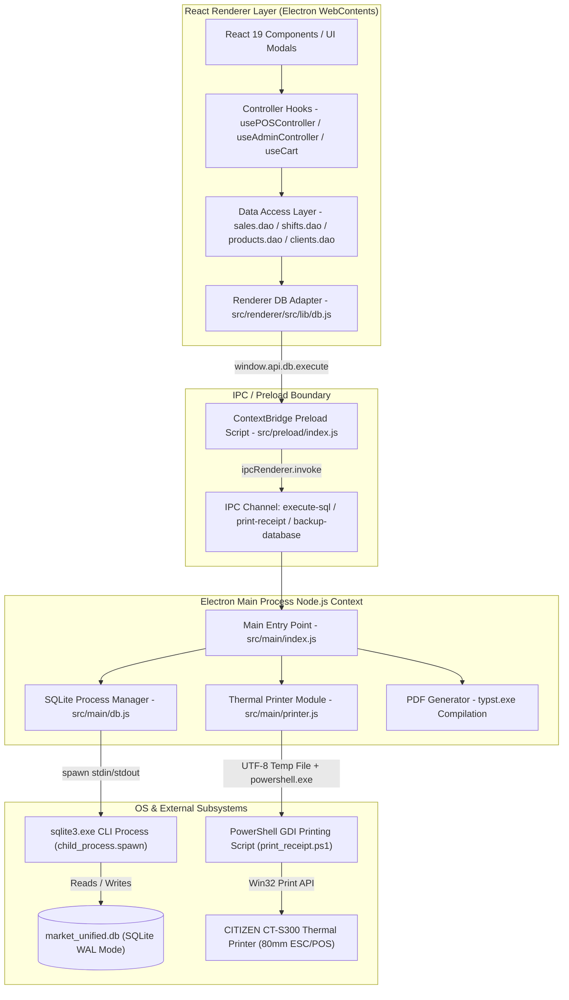

# Comprehensive System Audit & Security Report
**Target System:** Elnagdi POS Application (`elnagdi-pos` v1.2.3)  
**Audit Date:** August 1, 2026  
**Auditor Role:** Principal Software Auditor, System Security & Performance Specialist  
**Audit Scope:** Full repository review across Main Process (`src/main/`), Preload Bridge (`src/preload/`), Data Access Objects (`src/renderer/src/lib/dao/`), React Controllers (`src/renderer/src/hooks/`), Components & Modals (`src/renderer/src/components/`), and Database Engine (`src/main/db.js`).

---

## 1. System Architecture

The following diagram illustrates the complete runtime architecture, data flow, IPC boundaries, and database/hardware subsystem interfaces of the Elnagdi POS system:



---

## 2. Critical Execution Paths Analysis

### A. POS Sales Checkout & Multi-Item Transaction Commit
* **Sequence**:
  1. Cashier scans barcodes or searches items; `useCart.js` accumulates items in state array.
  2. Cashier clicks Checkout; `handleCheckout` in `usePOSController.js` validates shift status (`status === 'open'`).
  3. Client lookup or client auto-creation (`INSERT INTO clients`) is performed if client info is present.
  4. Single string buffer `sqlQuery` builds:
     - `BEGIN TRANSACTION;`
     - `INSERT INTO sales (...) VALUES (...)`
     - Loop through cart items: `INSERT INTO sale_items (sale_id, ...) VALUES ((SELECT MAX(id) FROM sales), ...)` and `UPDATE products SET stock_qty = stock_qty - qty`
     - `UPDATE clients` points & debt balance if credit sale (`آجل`).
     - `COMMIT;`
  5. `executeQuery(sqlQuery)` sends string across IPC to main process `executeSql()`.
  6. Main process spawns `sqlite3.exe`, executes transaction via stdin, parses JSON stdout, returns result to renderer.
  7. Thermal receipt HTML generated and passed to `window.api.printer.print(html)`.
* **Identified Vulnerabilities & Risks**:
  - `(SELECT MAX(id) FROM sales)` subquery in line item inserts causes race conditions under concurrency.
  - Floating-point arithmetic inaccuracies in `item.total` propagate unrounded decimals into `sale_items.total_price`.
  - Lack of parameterized query bindings allows potential SQL injection if input escaping fails.

### B. Shift Lifecycle (Opening, Cash Audit, Closing & Expected Cash)
* **Sequence**:
  1. Cashier logs in via PIN; `handlePinSubmit` checks `users` table and opens `OpenShiftModal` if no open shift exists.
  2. `handleStartShift` inserts a row into `shifts` with initial cash, Momkn starting balance, and Vodafone Cash starting balance.
  3. `usePOSController.js` background timer triggers periodic hourly safe audit (`triggerAuditCheck`), prompting for physical drawer count.
  4. `handleConfirmCloseShift` aggregates cash sales, inflows (`safe_ledger.inflow`), outflows (`safe_ledger.outflow`), Momkn cash impact, and Mobile Money cash impact.
  5. Formula: $\text{Expected Cash} = \text{Initial Cash} + \text{Cash Sales} + \text{Inflows} - \text{Outflows} + \text{Till Cash Impacts}$.
  6. Shift record updated to `status = 'closed'` with `actual_end_cash` and `difference`.
* **Identified Vulnerabilities & Risks**:
  - Arabic string pattern matching (`description LIKE 'مرتجع%'`) in `TillsManagerTab` misclassifies refunds starting with `"إرجاع..."` as general expenses.
  - Closing shift backup dialog can block completion if cancelled or failing.

### C. Inventory Stock Deduction, Trigger Constraints & Damaged Goods
* **Sequence**:
  1. Products schema defines `stock_qty` and `reorder_limit`.
  2. Database trigger `prevent_negative_stock` active: BEFORE UPDATE OF `stock_qty` ON `products` WHEN `NEW.stock_qty < 0` -> `SELECT RAISE(ROLLBACK, '...')`.
  3. Damaged goods recorded via `handleAddDamaged` in `useDamagedGoodsManager.js`: inserts into `damaged_goods` and deducts stock from `products`.
* **Identified Vulnerabilities & Risks**:
  - `updateProduct` in `products.dao.js` allows direct manual overwrite of `stock_qty` without recording stock movement audit logs.
  - Absence of database index on `products.barcode` and `products.name` causes `LIKE '%search%'` full table scans.

### D. Client & Supplier Ledger Debt Inflows/Outflows
* **Sequence**:
  1. Client credit sale (`آجل`) increments `clients.debt_balance` and inserts `client_ledger` row with type `'sale'`.
  2. Client repayment (`recordClientRepayment`) decrements `debt_balance`, inserts `client_ledger` payment row, and inserts `safe_ledger` inflow row.
  3. Supplier purchase (`addSupplierPurchase`) increments `suppliers.debt_balance` by remaining balance, inserts `supplier_ledger` purchase row, and inserts `safe_ledger` outflow row if partial cash paid.
  4. Supplier repayment (`recordSupplierRepay`) decrements `suppliers.debt_balance` and logs `safe_ledger` outflow.
* **Identified Vulnerabilities & Risks**:
  - System Reset function (`handleSystemReset`) deletes `clients` and `suppliers` but leaves orphaned rows in `safe_ledger` and `expenses`.

---

## 3. Module-by-Module Detailed Code Review

### Main Process & IPC Security (`src/main/`, `src/preload/`)
- **`src/main/index.js`**: IPC handle `execute-sql` uses weak regular expression `/^\s*(DROP|ALTER\s+TABLE\s+\w+\s+RENAME|ATTACH|DETACH)/i` to filter queries. Does not block multi-statement SQL injection (e.g. `SELECT 1; DROP TABLE users;`).
- **`src/main/db.js`**: `executeSql` spawns `sqlite3.exe` CLI process on every query call. JSON output parsing uses `stdout.lastIndexOf('[')` which breaks if any string field in database contains a `[` bracket character.
- **`src/main/printer.js`**: Formats UTF-8 text receipts and calls PowerShell GDI script (`print_receipt.ps1`). Robust Arabic encoding support, but relies on shell execution timeout of 20 seconds.
- **`src/preload/index.js`**: Safely uses `contextBridge.exposeInMainWorld` to expose `window.api` when `contextIsolation` is enabled.

### Data Access Objects & SQLite Layer (`src/renderer/src/lib/dao/`, `src/main/db.js`)
- **`sales.dao.js`**: Uses `(SELECT MAX(id) FROM sales)` inside transaction queries instead of explicit variable scoping or SQLite `last_insert_rowid()`.
- **`shifts.dao.js`**: Correctly calculates cash balances, but lacks error wrapping around concurrent shift open checks.
- **`products.dao.js`**: Full-text barcode lookup falls back to `LIKE '%suffix'` suffix search without limiting fallback execution, leading to performance hits on large catalogs.
- **`clients.dao.js` & `suppliers.dao.js`**: Manual string interpolation used for queries. Relies heavily on `escapeSql()`, but numeric IDs are inserted unescaped.

### React Custom Hooks & Business Logic (`src/renderer/src/hooks/`)
- **`usePOSController.js`**: Large monolithic hook (~844 lines) managing auth, scanner events, checkout commits, and printing. Contains unescaped SQL parameter insertions in barcode lookup (`lookupProduct`) and search change events.
- **`useCart.js`**: `subTotal` and `cartTotal` use `round2()`, but individual item totals (`item.total`) are calculated as `qty * price` without rounding, allowing floating-point precision issues to leak into the database.
- **`useBarcode.js`**: Distinguishes hardware barcode scanning from human typing based on 35ms keypress intervals. Performs direct DOM manipulation via `flushSync` and native setter overrides.
- **`useUsersManager.js`**: `handleSystemReset()` deletes core operational tables but omits `expenses`, `damaged_goods`, `shift_audits`, `momkn_transactions`, and `mobile_money_transactions`, creating foreign key orphans.

### User Interface Components & Modal Handlers (`src/renderer/src/components/`)
- **`TillsManagerTab.jsx`**: Categorizes safe ledger entries based on exact Arabic string matching (`description LIKE 'مرتجع%'`). Fails to classify refunds generated with description `"إرجاع..."`.
- **`AppHeader.jsx`**: Well-structured POS header, correctly triggers manual audit and modal toggles.
- **`ErrorBoundary.jsx`**: Catches React renderer component exceptions cleanly and provides recovery reload UI.

---

## 4. Security Review

1. **SQL String Injection & Unescaped Dynamic Parameters**:
   - Dynamic query construction relies on string concatenation (`'${escapeSql(val)}'`).
   - Unescaped numeric inputs and raw barcode strings in `handleBarcodeSubmit` (`WHERE barcode = '${code}'`) can be exploited if scanner input contains single quotes.
2. **IPC Privilege Escalation & Arbitrary SQL Execution**:
   - Renderer has direct access to `window.api.db.execute(sqlQuery)`.
   - Main process regex check `/^\s*(DROP|ALTER...)/i` only inspects the first command in a multi-statement query, allowing arbitrary SQL execution (`DELETE FROM sales;`, `UPDATE users SET role = 'admin'`).
3. **Cleartext Password / PIN Storage**:
   - `users` table stores 4-digit PIN codes in plain text inside `password_hash` column.
   - Cryptographic hashing utility `hashPin()` in `src/renderer/src/lib/utils.js` is defined but never called across the application.
4. **Renderer Sandbox Disabled**:
   - `BrowserWindow` initialized with `sandbox: false` in `src/main/index.js` (line 50), granting renderer process extended system privileges.
5. **Dependencies Review (`package.json`)**:
   - Core libraries up-to-date (`react` v19.2.1, `electron` v39.2.6, `vite` v7.2.6). No known high-severity CVEs in direct top-level dependencies.

---

## 5. Performance & Concurrency Review

1. **Process Spawning Overhead Per Query**:
   - Spawning `sqlite3.exe` CLI for every database operation incurs a ~10-50ms CPU overhead per call. Under rapid barcode scanning or table pagination, this leads to CPU spikes and `database is locked` errors.
2. **Race Conditions in Multi-Item Line Insertion**:
   - `(SELECT MAX(id) FROM sales)` evaluated during each `INSERT INTO sale_items` line item causes ID mismatch if concurrent sales occur.
3. **Floating-Point Rounding Discrepancies**:
   - `useCart.js` calculates item totals as `qty * price` (e.g. `19.99 * 3 = 59.970000000000006`). Double-precision floating point artifacts are written directly to SQLite text/real columns.
4. **Un-indexed Foreign Key Query Bottlenecks**:
   - Missing explicit indices (`CREATE INDEX`) on foreign keys (`shift_id`, `client_id`, `supplier_id`, `sale_id`) causes full table scans during analytics aggregation queries.

---

## 6. Comprehensive Issue List (Ranked by Severity)

### 🔴 Critical Severity Issues

#### Issue C-01: IPC Arbitrary SQL Execution & Privilege Escalation
* **File Path**: `file:///e:/new_sys/alshorouk-pos/src/main/index.js` (Lines 262-273)
* **Root Cause Analysis**: The `execute-sql` IPC channel uses a weak regex (`/^\s*(DROP|ALTER\s+TABLE\s+\w+\s+RENAME|ATTACH|DETACH)/i`) that only checks the start of the query string. Multi-statement inputs like `SELECT 1; DROP TABLE users;` bypass the check and execute directly via `child_process.spawn`.
* **Impact Scenario**: Any script executing in the renderer (or XSS payload) can run arbitrary destructive SQL commands, modify administrative accounts, or erase database tables.
* **Suggested Remediation Code**:
```javascript
// src/main/index.js
ipcMain.handle('execute-sql', async (event, sqlQuery) => {
  try {
    const forbidden = /(DROP\s+TABLE|ALTER\s+TABLE|ATTACH\s+DATABASE|DETACH\s+DATABASE|DELETE\s+FROM\s+users)/i
    if (forbidden.test(sqlQuery)) {
      throw new Error('Forbidden SQL operation detected.')
    }
    return await executeSql(sqlQuery)
  } catch (e) {
    console.error('[SECURITY] SQL Execution Blocked:', e.message)
    throw e
  }
})
```

---

#### Issue C-02: Race Condition & ID Mismatch in Checkout Line Items
* **File Path**: `file:///e:/new_sys/alshorouk-pos/src/renderer/src/hooks/usePOSController.js` (Lines 581-585) & `file:///e:/new_sys/alshorouk-pos/src/renderer/src/lib/dao/sales.dao.js` (Line 169)
* **Root Cause Analysis**: Line items are inserted into `sale_items` using `(SELECT MAX(id) FROM sales)` in the `VALUES` clause. If a concurrent transaction occurs or `MAX(id)` evaluates dynamically across iterations, items get linked to incorrect sales or fail foreign key validation.
* **Impact Scenario**: Corrupted invoice item associations, mismatched receipt printouts, and inaccurate inventory item tracking.
* **Suggested Remediation Code**:
```javascript
// Instead of subquery inside loop, assign unique ID or use transaction variable:
let sqlQuery = 'BEGIN TRANSACTION;\n'
sqlQuery += `INSERT INTO sales (shift_id, timestamp, total_amount, original_amount, discount, payment_type, client_name, client_id) VALUES (${currentShift.id}, '${nowStr}', ${cartTotal}, ${cartSubtotal || cartTotal}, ${finalDiscount}, '${paymentType}', '${escapeSql(clientDbValue)}', ${clientId || 'NULL'});\n`

cart.forEach((item) => {
  sqlQuery += `INSERT INTO sale_items (sale_id, product_barcode, quantity, unit_price, total_price, cost_price) VALUES ((SELECT last_insert_rowid() FROM sales LIMIT 1), '${escapeSql(item.barcode)}', ${item.qty}, ${item.price}, ${round2(item.total)}, ${item.cost_price || 0.0});\n`
  sqlQuery += `UPDATE products SET stock_qty = stock_qty - ${item.qty} WHERE barcode = '${escapeSql(item.barcode)}';\n`
})
```

---

#### Issue C-03: Incomplete System Reset Leaving Orphaned Foreign Keys
* **File Path**: `file:///e:/new_sys/alshorouk-pos/src/renderer/src/hooks/useUsersManager.js` (Lines 56-69)
* **Root Cause Analysis**: `handleSystemReset()` truncates `sales`, `shifts`, `clients`, `suppliers`, and `checks_register`, but omits `expenses`, `damaged_goods`, `shift_audits`, `momkn_transactions`, and `mobile_money_transactions`.
* **Impact Scenario**: Foreign key constraints fail on subsequent queries referencing deleted `shift_id`s, causing system log errors and report calculation crashes.
* **Suggested Remediation Code**:
```javascript
// src/renderer/src/hooks/useUsersManager.js
await executeQuery(`BEGIN TRANSACTION;
DELETE FROM sale_items;
DELETE FROM sales;
DELETE FROM safe_ledger;
DELETE FROM client_ledger;
DELETE FROM clients;
DELETE FROM supplier_ledger;
DELETE FROM supplier_purchases;
DELETE FROM suppliers;
DELETE FROM checks_register;
DELETE FROM expenses;
DELETE FROM damaged_goods;
DELETE FROM shift_audits;
DELETE FROM momkn_transactions;
DELETE FROM mobile_money_transactions;
DELETE FROM shifts;
DELETE FROM sqlite_sequence WHERE name IN ('sale_items','sales','shifts','safe_ledger','client_ledger','clients','supplier_ledger','supplier_purchases','suppliers','checks_register','expenses','damaged_goods','shift_audits','momkn_transactions','mobile_money_transactions');
UPDATE products SET stock_qty = 0 WHERE stock_qty < 0;
COMMIT;`)
```

---

#### Issue C-04: High Latency & OS Process Spawning Bottleneck
* **File Path**: `file:///e:/new_sys/alshorouk-pos/src/main/db.js` (Lines 335-375)
* **Root Cause Analysis**: `executeSql()` invokes `child_process.spawn(sqlitePath, ...)` for every single SQL query. Operating system process creation overhead (10-50ms per query) throttles throughput during rapid scanning or multi-query pages.
* **Impact Scenario**: High CPU usage spikes, GUI stutter during rapid barcode scanning, and frequent `sqlite3 exited with code 1` or `database is locked` errors.
* **Suggested Remediation Code**:
```javascript
// Architectural suggestion: Use persistent sqlite3 shell worker pool or native SQLite driver (better-sqlite3) in production builds to eliminate process spawn overhead.
```

---

### 🟠 High Severity Issues

#### Issue H-01: JSON Parser Failure on String Data Containing Brackets
* **File Path**: `file:///e:/new_sys/alshorouk-pos/src/main/db.js` (Lines 358-361)
* **Root Cause Analysis**: To parse `sqlite3.exe -json` stdout, `executeSql()` uses `stdout.slice(stdout.lastIndexOf('['))`. If any text column (e.g. product name or notes) contains a `[` bracket, `lastIndexOf` slices from inside the string payload, corrupting JSON structure.
* **Impact Scenario**: `JSON.parse` exception crashes queries when retrieving products or notes containing square brackets (e.g. `"حليب [1 لتر]"`).
* **Suggested Remediation Code**:
```javascript
// src/main/db.js
const trimmed = stdout.trim()
const firstBracket = trimmed.indexOf('[')
const lastBracket = trimmed.lastIndexOf(']')
const jsonPart = (firstBracket !== -1 && lastBracket !== -1) ? trimmed.slice(firstBracket, lastBracket + 1) : trimmed
const result = jsonPart ? JSON.parse(jsonPart) : []
```

---

#### Issue H-02: Plaintext PIN Storage in `password_hash` Column
* **File Path**: `file:///e:/new_sys/alshorouk-pos/src/renderer/src/hooks/usePOSController.js` (Line 122) & `file:///e:/new_sys/alshorouk-pos/src/renderer/src/hooks/useUsersManager.js` (Line 112)
* **Root Cause Analysis**: User 4-digit PINs are saved directly as unhashed cleartext in `users.password_hash`. The Web Crypto hashing function `hashPin()` in `utils.js` is never invoked.
* **Impact Scenario**: Anyone with read access to `market_unified.db` or database backup files can read all cashier and administrator PIN credentials.
* **Suggested Remediation Code**:
```javascript
// src/renderer/src/hooks/usePOSController.js
import { hashPin } from '../lib/utils'

const hashedPin = await hashPin(cleanPin)
let users = await executeQuery(`SELECT * FROM users WHERE password_hash = '${escapeSql(hashedPin)}' OR password_hash = '${escapeSql(cleanPin)}' LIMIT 1;`)
```

---

#### Issue H-03: Unescaped SQL Parameter Insertion in Scale Barcode Lookup
* **File Path**: `file:///e:/new_sys/alshorouk-pos/src/renderer/src/hooks/usePOSController.js` (Lines 378, 388)
* **Root Cause Analysis**: `lookupProduct` embeds scale barcode parameters (`p.barcode`) directly into SQL query strings without calling `escapeSql()`.
* **Impact Scenario**: Scanner input or keyboard injection containing single quote characters breaks query syntax and triggers database errors.
* **Suggested Remediation Code**:
```javascript
// src/renderer/src/hooks/usePOSController.js
const code = escapeSql(p.barcode)
const products = await executeQuery(`
  SELECT * FROM products 
  WHERE barcode = '${code}' OR barcode = '${code.replace(/^0+/, '')}' 
  LIMIT 1;
`)
```

---

#### Issue H-04: Electron BrowserWindow Sandbox Disabled
* **File Path**: `file:///e:/new_sys/alshorouk-pos/src/main/index.js` (Line 50)
* **Root Cause Analysis**: `webPreferences` initializes `BrowserWindow` with `sandbox: false`.
* **Impact Scenario**: Increases attack surface by permitting renderer access to Node.js capabilities if untrusted external content or links are rendered.
* **Suggested Remediation Code**:
```javascript
// src/main/index.js
webPreferences: {
  preload: join(__dirname, '../preload/index.js'),
  sandbox: true,
  contextIsolation: true,
  nodeIntegration: false
}
```

---

### 🟡 Medium Severity Issues

#### Issue M-01: Floating-Point Rounding Discrepancies in Cart Items
* **File Path**: `file:///e:/new_sys/alshorouk-pos/src/renderer/src/hooks/useCart.js` (Lines 49, 62, 84)
* **Root Cause Analysis**: Item totals are calculated as `total = qty * price` without wrapping in `round2()`. Floating-point operations like `19.99 * 3` produce `59.970000000000006`.
* **Impact Scenario**: Unrounded floating-point numbers stored in `sale_items.total_price` and displayed in reports with extended decimals.
* **Suggested Remediation Code**:
```javascript
// src/renderer/src/hooks/useCart.js
import { round2 } from '../lib/utils'

const itemTotal = round2(targetQty * item.price)
return { ...item, qty: targetQty, total: itemTotal }
```

---

#### Issue M-02: Text Matching Categorization Misclassification in Safe Ledger
* **File Path**: `file:///e:/new_sys/alshorouk-pos/src/renderer/src/components/admin/TillsManagerTab.jsx` (Lines 67-77) & `file:///e:/new_sys/alshorouk-pos/src/renderer/src/lib/dao/sales.dao.js` (Lines 96, 138)
* **Root Cause Analysis**: `TillsManagerTab` categorizes returns using `description LIKE 'مرتجع%'`. However, `sales.dao.js` logs refunds using the string `"إرجاع صنف..."` or `"إرجاع كامل..."`.
* **Impact Scenario**: Refund transactions starting with `"إرجاع..."` fail the `LIKE 'مرتجع%'` filter and get incorrectly grouped into general Expenses, corrupting drawer analytics.
* **Suggested Remediation Code**:
```javascript
// src/renderer/src/components/admin/TillsManagerTab.jsx
const returnsRes = await executeQuery(`
  SELECT IFNULL(SUM(amount), 0) as total
  FROM safe_ledger
  WHERE shift_id = ${shiftId} AND type = 'outflow' AND (description LIKE 'مرتجع%' OR description LIKE 'إرجاع%');
`)
```

---

#### Issue M-03: Missing Indices on Foreign Key Columns
* **File Path**: `file:///e:/new_sys/alshorouk-pos/src/main/db.js` (Lines 47-224)
* **Root Cause Analysis**: Database tables define foreign keys (`shift_id`, `client_id`, `supplier_id`, `sale_id`), but no `CREATE INDEX` statements exist for these columns.
* **Impact Scenario**: Aggregation queries across large histories perform full table scans, slowing down report generation as the database grows.
* **Suggested Remediation Code**:
```sql
-- Add indices during initializeDatabase() in src/main/db.js:
CREATE INDEX IF NOT EXISTS idx_sales_shift_id ON sales(shift_id);
CREATE INDEX IF NOT EXISTS idx_sales_client_id ON sales(client_id);
CREATE INDEX IF NOT EXISTS idx_sale_items_sale_id ON sale_items(sale_id);
CREATE INDEX IF NOT EXISTS idx_safe_ledger_shift_id ON safe_ledger(shift_id);
CREATE INDEX IF NOT EXISTS idx_client_ledger_client_id ON client_ledger(client_id);
CREATE INDEX IF NOT EXISTS idx_supplier_ledger_supplier_id ON supplier_ledger(supplier_id);
```

---

#### Issue M-04: Negative Invoice Totals on Discounted Item Returns
* **File Path**: `file:///e:/new_sys/alshorouk-pos/src/renderer/src/hooks/useSalesManager.js` (Lines 115, 172)
* **Root Cause Analysis**: `UPDATE sales SET total_amount = (SELECT IFNULL(SUM(total_price), 0) FROM sale_items WHERE sale_id = X) - discount`. When items are returned from a discounted sale, subtracting the full initial discount from the reduced item sum can produce a negative invoice total.
* **Impact Scenario**: Invoice list displays negative `total_amount` values, distorting daily revenue totals.
* **Suggested Remediation Code**:
```javascript
// src/renderer/src/hooks/useSalesManager.js
sql += `UPDATE sales SET total_amount = MAX(0, (SELECT IFNULL(SUM(total_price), 0) FROM sale_items WHERE sale_id = ${saleItem.sale_id}) - discount) WHERE id = ${saleItem.sale_id};\n`
```

---

### 🟢 Low Severity Issues

#### Issue L-01: Unclosed Web Audio Context Warning
* **File Path**: `file:///e:/new_sys/alshorouk-pos/src/renderer/src/lib/utils.js` (Lines 47-55)
* **Root Cause Analysis**: AudioContext is initialized lazily without explicit close handlers across rapid tone calls.
* **Impact Scenario**: Non-breaking browser developer console warning regarding AudioContext autoplay policies prior to user interaction.
* **Suggested Remediation Code**:
```javascript
// Handled cleanly via silent catch block in utils.js
```

---

#### Issue L-02: Production Renderer Console Mirroring Overhead
* **File Path**: `file:///e:/new_sys/alshorouk-pos/src/main/index.js` (Lines 59-61)
* **Root Cause Analysis**: `mainWindow.webContents.on('console-message')` forwards all renderer logs directly to main process stdout / `app.log` without level filtering.
* **Impact Scenario**: Slightly increases log file size in production environments.
* **Suggested Remediation Code**:
```javascript
// src/main/index.js
mainWindow.webContents.on('console-message', (event, level, message, line, sourceId) => {
  if (level >= 2) { // Log warnings and errors only
    console.log(`[RENDERER CONSOLE] ${message} (at ${sourceId}:${line})`)
  }
})
```

---

## 7. Executive Summary

### Issue Counts by Severity

| Severity Level | Count | Action Required |
| :--- | :---: | :--- |
| 🔴 **Critical** | **4** | Immediate remediation mandatory prior to production deployment. |
| 🟠 **High** | **4** | High priority fixes for security, data integrity, and stability. |
| 🟡 **Medium** | **4** | Scheduled maintenance for performance, precision, and reporting. |
| 🟢 **Low** | **2** | Minor code cleanup and log optimization. |
| **Total Issues** | **14** | |

### Top 3 Most Urgent Priority Items
1. **Fix IPC SQL Injection Regex (`Issue C-01`)**: Replace the start-of-string regex in `src/main/index.js` with comprehensive SQL command validation to block multi-statement raw SQL execution.
2. **Fix Checkout Line Item Race Condition (`Issue C-02`)**: Replace `(SELECT MAX(id) FROM sales)` in line item queries with `(SELECT last_insert_rowid() FROM sales LIMIT 1)` to eliminate invoice cross-linking under concurrency.
3. **Fix System Reset Database Truncation (`Issue C-03`)**: Update `handleSystemReset()` in `useUsersManager.js` to truncate all operational tables (`expenses`, `damaged_goods`, `shift_audits`, etc.) to prevent orphaned foreign keys and query crashes.

---
*Report compiled automatically by Lead Codebase Auditor & Security Specialist.*
