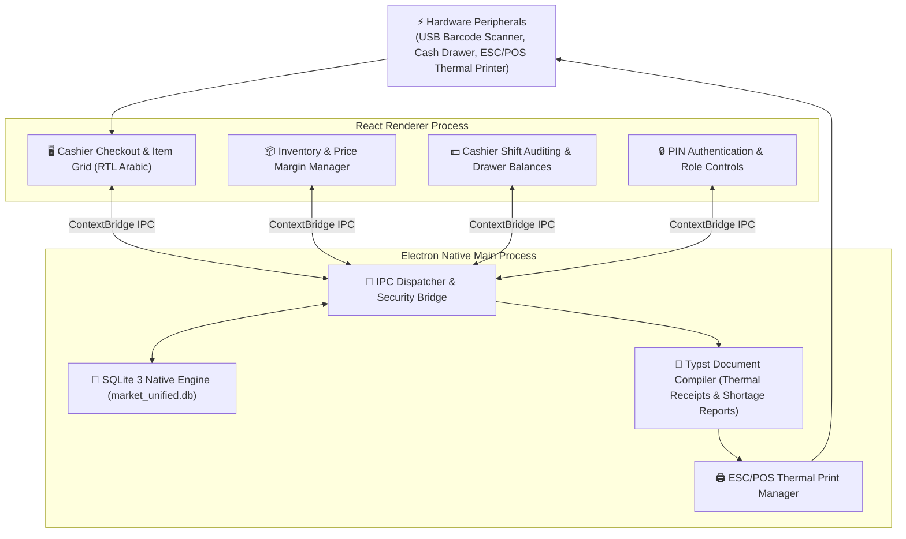

<div align="center">

# 🛒 Elnagdi POS: Retail Point of Sale Desktop System

### Production-Ready Supermarket POS & Inventory Management Desktop Application

[](https://www.electronjs.org/)
[](https://reactjs.org/)
[](https://vitejs.dev/)
[](https://www.sqlite.org/)
[](https://typst.app/)
[](https://tailwindcss.com/)
[](LICENSE)

**Offline-First SQLite Architecture • Hardware Barcode Scanner Bridge • Typst Thermal Receipts • Native RTL Arabic UI**

[System Architecture](#-system-architecture) • [Key Capabilities](#-key-capabilities) • [Local Development](#-development--build) • [Production Packaging](#-production-packaging)

</div>

---

## 🎯 Overview

**Elnagdi POS** is a high-reliability desktop Point of Sale (POS) and store management system built for high-throughput commercial retail and grocery environments.

Engineered with an offline-first **Electron + Vite + React** architecture and local **SQLite** database storage, the system ensures zero downtime during internet outages. It features sub-millisecond barcode lookups, granular cashier shift accounting, low-stock threshold monitoring, and automated thermal receipt generation powered by the high-speed **Typst** document compiler.

---

## 🏗 System Architecture



---

## 🌟 Key Capabilities

- ⚡ **High-Speed Checkout Engine:** Instant product lookup via USB/Bluetooth barcode scanners with automatic item aggregation and quantity calculation.
- 📴 **100% Offline-First Reliability:** Operates entirely locally using an embedded SQLite database engine; transactions and receipts continue uninterrupted during internet cuts.
- 📄 **Typst-Powered Thermal Receipts:** Generates pixel-perfect 80mm/58mm thermal receipts in milliseconds using the high-performance Typst typesetting engine.
- 💵 **Cashier Shift Reconciliation:** Strict cash drawer balance enforcement, beginning-of-shift floats, mid-shift withdrawals, and automated end-of-day X/Z audit reports.
- 📊 **Dynamic Inventory & Shortages:** Automatic inventory deduction upon checkout, custom cost-price tracking, and automatic shortage reports when items hit minimum thresholds.
- 🌍 **Native RTL Arabic User Experience:** Custom Arabic design tokens, ergonomic keyboard shortcuts (F1-F12), and touch-friendly interface layouts.
- 🔐 **Role-Based Security:** PIN-protected authorization for sensitive operations (cashier refunds, item deletions, manager discounts, and inventory edits).

---

## 💻 Development & Build

### Prerequisites
- **Node.js 18+** & **npm**
- Windows OS (for running pre-bundled `sqlite3.exe` and `typst.exe` binaries)

### 1. Installation
```bash
# Clone the repository
git clone https://github.com/3bkader-gpt/elnagdi-pos.git
cd elnagdi-pos

# Install dependencies
npm install
```

### 2. Running in Development Mode
```bash
# Start Vite development server with Electron hot reload
npm run dev
```

---

## 📦 Production Packaging

Compile and build standalone installer packages:

```bash
# Package for Windows (.exe / NSIS Installer)
npm run build:win

# Build portable unpacked directory
npm run build:unpack
```

The output installers and portable binaries will be generated inside the `dist/` directory.

---

## 📄 License

This software is licensed under the [MIT License](LICENSE).
