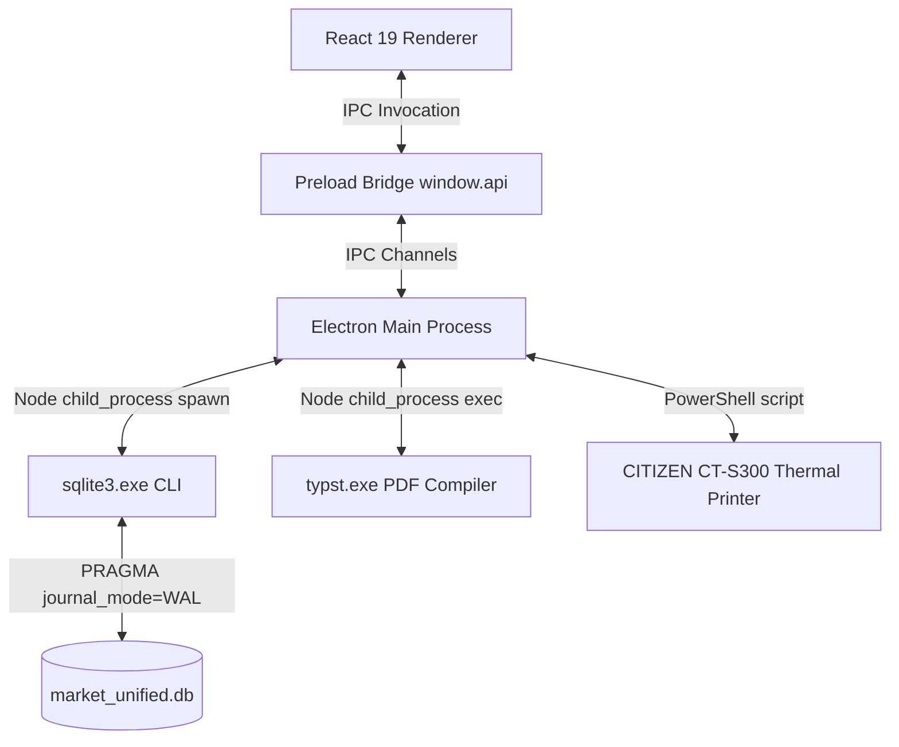

# Architecture Documentation

## 1. System Topology Overview
Elnagdi POS is constructed as a modern desktop application utilizing Electron as the runtime container. It implements a decoupled architecture consisting of a **Renderer Process** (handling UI and view logic via React 19) and a **Main Process** (managing native OS services, hardware integration, and database operations via Node.js).

---

## 2. IPC Architecture & Communication Bridge
Security and stability are maintained by separating the frontend from the Node.js runtime. Direct Node integration is disabled in the renderer. Communication is restricted to explicit IPC channels configured in `src/preload/index.js` and exposed via `contextBridge`.

### A. Core IPC Channels
*   `execute-sql`: Invoked by `executeQuery` in `src/renderer/src/lib/db.js`. Executes a raw SQL query inside the main process database queue and returns JSON results.
*   `print-receipt`: Sends rendered HTML content to the main process thermal printer utility.
*   `generate-shortages-pdf`: Receives shortage list items, compiles them to a Typst template, compiles the template to PDF using `typst.exe`, and opens it.

---

## 3. Database Architecture (CLI Wrapper SQLite)
Unlike conventional setups using native modules like `better-sqlite3` (which can cause compilation and path issues across Node versions), Elnagdi POS interacts with SQLite via a custom child process spawned bridge.

### Execution Mechanism
1.  **Process Spawning:** In `src/main/db.js`, `sqlite3.exe` is resolved locally (based on whether the application is running in development or packaged).
2.  **Input/Output Pipe:** When `executeSql(sqlQuery)` is invoked, it spawns `sqlite3.exe` with `[dbPath, '-json']`.
3.  **Referential Integrity & Transactions:** The wrapper prepends `PRAGMA foreign_keys = ON;` to every stream session to guarantee foreign key constraint enforcement.
4.  **JSON Deserialization:** The output stream is gathered from `stdout`, parsed from a JSON string, and returned as a JavaScript array of row objects.

### Concurrency Strategy (WAL Mode)
To prevent database locks (`SQLITE_BUSY` errors) when the administrator is fetching heavy reports during active sales sessions:
*   The database is initialized with `PRAGMA journal_mode=WAL;` (Write-Ahead Logging).
*   WAL permits concurrent reading processes to access the database without being blocked by ongoing write operations.

---

## 4. Hardware & Printing Architecture
Supermarket operations require rapid printing of receipt tickets. Elnagdi POS routes printing commands through specialized system interfaces:

*   **Arabic Text Rendering (GDI Wrapper):** Arabic text requires proper right-to-left layout and contextual glyph shaping (ligatures). To achieve this on standard ESC/POS hardware without complex device-level firmware loading, the system leverages a PowerShell wrapper utilizing the Windows Graphical Device Interface (GDI) to paint Arabic text accurately on the thermal printer canvas.
*   **Settings Integration:** The active printer name is fetched dynamically from the database `settings` table (`printer_name` key) before routing print requests.

---

## 5. Report Generation (Typst Compiler)
*   **Compiler Bin:** `typst.exe` is packaged within the application resources.
*   **Template Flow:** Shortages data is converted to a dynamic `.typ` markup document inside the system's temporary directory.
*   **PDF Compilation:** `typst compile <template.typ> <output.pdf>` is executed asynchronously.
*   **Viewer Open:** The resulting PDF is opened using Electron's `shell.openPath`.
